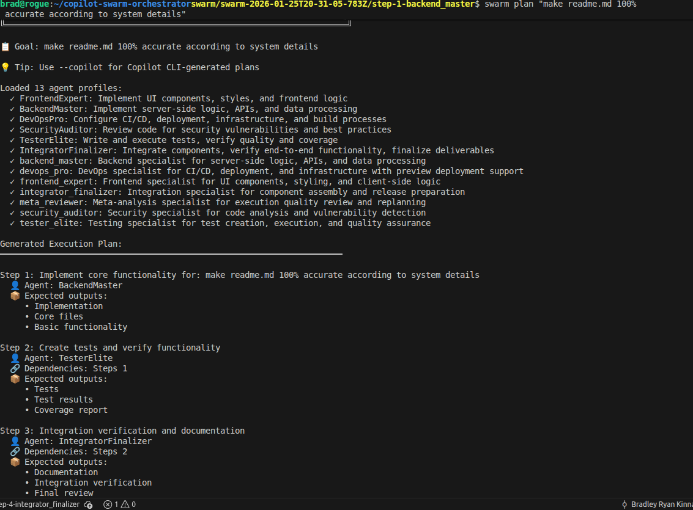
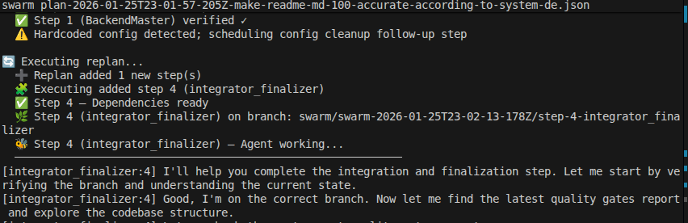

# Copilot Swarm Orchestrator

Parallel execution of GitHub Copilot CLI sessions with dependency-aware scheduling, verification, and per-agent git branches.

[](https://github.com/moonrunnerkc/copilot-swarm-orchestrator/actions/workflows/ci.yml)
[](LICENSE)
[](https://www.typescriptlang.org/)

---

## Quick Links

- **Watch demo (fresh project):** https://youtu.be/TKSlRksNLUA
- **Run demo:** `npm start demo todo-app`
- **Fast demo (2-step):** `npm start demo-fast`
- **Jump to:** [Commands](#commands) · [Demo Scenarios](#demo-scenarios) · [Verification](#verification)

## Why This Exists

Running multiple Copilot CLI sessions for a project (backend, frontend, tests, integration) creates coordination overhead. This tool organizes that work into dependency-aware steps, runs independent steps in parallel, and verifies results from transcript evidence.

---

## What It Does

- Takes a goal (for example: "Build a todo app with React frontend and Express backend")
- Generates an execution plan with steps assigned to specialized agents
- Executes steps in parallel waves based on a dependency graph
- Runs each step as a `copilot -p` session on an isolated git branch
- Verifies each step by parsing the transcript for evidence (tests passed, files created, commits made)
- Auto-merges verified branches back to main

When you run this tool inside a repo, it writes a small set of **execution artifacts** into that repo
(`runs/`, `plans/`, `proof/`, etc.) so you have an auditable record of what happened.

**What it does not do**

> - Does not embed or simulate Copilot
> - Does not invent Copilot CLI flags or features
> - Does not guarantee the model completes tasks correctly

All execution uses real `copilot -p` with documented flags.

---

## Quick Start

```bash
git clone https://github.com/moonrunnerkc/copilot-swarm-orchestrator.git
cd copilot-swarm-orchestrator
npm install
npm run build
npm test          # 313 passing, 1 pending
```

### Running Commands

**Option A: Use npm start (no setup)**

```bash
npm start demo todo-app
npm start plan "Build a REST API"
npm start quick "Add login route"
```

**Option B: Link globally (recommended for frequent use)**

```bash
npm link
# Now you can use `swarm` from anywhere:
swarm demo todo-app
swarm plan "Build a REST API"
swarm quick "Add login route"
```

To unlink later: `npm unlink -g copilot-swarm-orchestrator`

**Requirements**: Node.js 18+, GitHub Copilot CLI installed and authenticated.

---

## Commands

| Command | What it does |
|---|---|
| `npm start bootstrap <path(s)> "Goal"` | Analyze repo(s), optionally ingest open issues via `gh`, and generate a plan |
| `npm start demo todo-app` | Run 4-step demo with parallel execution |
| `npm start demo-fast` | Run fast 2-step hello-world swarm demo |
| `npm start demo list` | List available demo scenarios |
| `npm start plan "goal"` | Generate execution plan for a goal |
| `npm start swarm plan.json` | Execute plan in parallel swarm mode |
| `npm start swarm plan.json --confirm-deploy` | Execute with opt-in deployment for DevOpsPro |
| `npm start quick "task"` | Quick single-agent task (no plan needed) |
| `npm start gates [path]` | Run quality gates on a project (default: cwd) |
| `npm start -- --help` | Show all options |

---

## Demo Scenarios

| Scenario | Steps | Duration | Description |
|---|---:|---:|---|
| `demo-fast` | 2 | 2-4 min | Hello-world swarm: tiny util + test in one wave |
| `todo-app` | 4 | 12-18 min | React + Express todo app |
| `api-server` | 6 | 20-30 min | REST API with auth and DB |
| `full-stack-app` | 7 | 25-35 min | Full-stack with deployment |
| `saas-mvp` | 8 | 30-45 min | SaaS with Stripe, analytics |

If you don't have time to wait for a full run, explore `examples/completed-run/` for a pre-baked look at what the orchestrator writes.

> **Note:** Duration depends on model latency and task complexity. Each step runs a real Copilot CLI session.

## Demo Media

**Screencast (fresh project run):** https://youtu.be/TKSlRksNLUA

**Screenshots (existing project run):**





---

## How It Works

### Architecture (text diagram)

```
cli.ts
  -> plan-generator.ts
  -> swarm-orchestrator.ts
      -> session-executor.ts
      -> verifier-engine.ts
          -> share-parser.ts
```

### Execution Flow

1. **Plan generation**: `PlanGenerator.createPlan()` assigns agents to tasks with dependencies
2. **Wave scheduling**: `SwarmOrchestrator.identifyExecutionWaves()` groups independent steps
3. **Branch creation**: each step runs on `swarm/<execid>/step-<n>-<agent>` branch
4. **Session execution**: `SessionExecutor.executeSession()` invokes `copilot -p` with prompt
5. **Verification**: `VerifierEngine.verifyStep()` checks transcript for evidence
6. **Merge**: verified branches merge to main via git

---

## What You Should Expect In Your Repo

This tool is an orchestrator with verification. That means it produces two kinds of output:

1. **Your actual project changes** (the thing you wanted)
   - Normal repo files: `src/`, `server.js`, `package.json`, tests, etc.
   - These land on per-step branches during execution and are merged back to your current branch when verified.

2. **Swarm execution artifacts** (the audit trail)
   - These are not “your app”. They are evidence and coordination state.
   - By default they are created in the repo you ran `swarm` from.

### Artifact folders

- `plans/`
  - Saved execution plans (`plan-*.json`, `bootstrap-*`).
- `runs/<run-id>/`
  - One folder per run.
  - `steps/step-N/share.md` is the Copilot `/share` transcript captured via `copilot -p --share ...`.
  - `steps/step-N/verification.md` is the verifier output (what was checked and what evidence was found).
  - `.locks/` and `.context/` are coordination state for parallel execution.
- `proof/`
  - Primarily used by sequential mode (`swarm execute`) to store “save your /share transcript here” paths.
- `.quickfix/`
  - Quick-fix transcripts and logs.

### Practical workflow

- To see what an agent actually did:
  - Open `runs/<run-id>/steps/step-1/share.md` and look for commands, diffs, and test output.
- To see what was verified:
  - Open `runs/<run-id>/steps/step-1/verification.md`.
- To see the final code:
  - Check your current branch after merges, or review git history (`git log`, `git show --name-only`).

### Keeping git history clean (recommended)

Most users keep these artifacts locally but do not commit them.
Add this to your repo’s `.gitignore` before running swarm:

```gitignore
plans/
runs/
proof/
.quickfix/
.context/
.locks/
```

If you want a completely clean repo during experimentation, run swarm in a disposable repo or scratch workspace.

---

## Custom Agents

Seven agents are defined in `.github/agents/`:

| Agent | Purpose | File |
|---|---|---|
| `backend_master` | Server-side logic, APIs | `backend-master.agent.md` |
| `frontend_expert` | UI components, React | `frontend-expert.agent.md` |
| `tester_elite` | Test suites, coverage | `tester-elite.agent.md` |
| `security_auditor` | Security hardening | `security-auditor.agent.md` |
| `devops_pro` | CI/CD, deployment | `devops-pro.agent.md` |
| `integrator_finalizer` | Final integration | `integrator-finalizer.agent.md` |
| `meta_reviewer` | Post-execution analysis | `meta-reviewer.agent.md` |

---

## Verification

Use these commands and outputs to verify the claims in this README.

### Test Suite

```bash
npm test
# Output: 313 passing, 1 pending (7s)
```

### CLI Help

```bash
npm start -- --help
# Shows all commands and flags
```

### Demo Execution

```bash
npm start demo todo-app
# Runs 4 steps in 3 waves with live output
```

### Parallelism Proof (Console)

To validate that steps in a wave run concurrently, use the live console logs:

- `swarm-orchestrator.ts` prints the wave header (for example: `Wave 1: 2 step(s) in parallel`).
- `session-executor.ts` supports a per-step `logPrefix`, which is used to prefix live output lines from each Copilot subprocess.
- When a wave contains multiple independent steps, you can see interleaved output lines from different prefixes.
- After each wave completes, a timing summary shows per-agent duration (for example: `BackendMaster:1 (45s)`).

**Note on status display:** All progress is shown via structured console output. There is no graphical TUI dashboard. A React/Ink-based dashboard component exists in `src/dashboard.tsx` but is disabled due to ESM/CommonJS incompatibility.

Proof anchors in code:

- `src/swarm-orchestrator.ts:identifyExecutionWaves()`
- `src/swarm-orchestrator.ts` (wave timing summary)
- `src/session-executor.ts` (`SessionOptions.logPrefix`)

### Source Structure

```bash
ls src/*.ts | wc -l           # 41 top-level source files
find src -name "*.ts" | wc -l # 55 total (includes subdirectories)
ls test/*.test.ts | wc -l     # 28 test files
```

---

## Constraints And Guarantees

- Requires GitHub Copilot CLI to be installed and authenticated
- Executes `copilot -p` as a subprocess; does not embed or simulate Copilot
- Uses only documented Copilot CLI flags (`-p`, `--model`, `--share`, etc.)
- Does not guarantee Copilot will complete tasks correctly; it orchestrates and verifies
- Verification is evidence-based (transcript parsing), not semantic understanding

What "adaptive" means here:

- The swarm execution uses a concurrency-limited queue and retries tasks that fail with rate-limit-like errors (see `src/execution-queue.ts`).
- After each wave, the orchestrator writes a wave analysis JSON file and can update `knowledge-base.json` (see `src/meta-analyzer.ts`, `src/knowledge-base.ts`, and `src/swarm-orchestrator.ts`).
- If a wave is unhealthy (over 50% failure rate), the orchestrator will retry the same failed steps on new branches with suffix like `step-3-retry1`. This preserves completed work and only re-runs what failed.
- Failed steps can be retried up to 3 times before being marked as permanently failed.
- Replan state is saved to `runs/<run-id>/replan-state.json` for audit purposes.

**What this does not do:**

- No autonomous graph modification. Retries apply only to the same step definition; the execution plan is not restructured.
- No semantic self-correction. If Copilot generates broken code, the orchestrator cannot fix it; it can only retry the step.
- Replan suggestions from `meta-reviewer` are advisory. They are recorded but not automatically acted upon beyond retries.

Optional deployment execution:

- Use `--confirm-deploy` flag to enable deployment for DevOpsPro agent steps.
- When enabled, the orchestrator will execute `vercel deploy` or `netlify deploy` if the platform is detected.
- Preview URLs are captured and stored in `runs/<run-id>/deployments/`.
- Deployment is opt-in only; no external CLI is executed without explicit user confirmation.

**What deployment does not handle:**

- No authentication management. You must be pre-authenticated with `vercel login` or `netlify login`.
- No deployment retries. If deployment fails, the failure is logged but not retried.
- No rollback. If a deployment breaks, you must roll back manually.
- No multi-platform fallback. Only one platform (Vercel or Netlify) is used per run based on detection order.

---

## File Structure

Key modules and their current line counts:

| File | Purpose | Lines |
|---|---|---:|
| `src/cli.ts` | CLI entry point | 996 |
| `src/swarm-orchestrator.ts` | parallel execution engine | 1491 |
| `src/plan-generator.ts` | plan creation and validation | 732 |
| `src/session-executor.ts` | Copilot CLI invocation | 430 |
| `src/verifier-engine.ts` | transcript verification | 476 |
| `src/share-parser.ts` | `/share` output parsing | 629 |
| `src/config-loader.ts` | agent YAML loading | 350 |

Compact view:

```
src/
  cli.ts
  swarm-orchestrator.ts
  plan-generator.ts
  session-executor.ts
  verifier-engine.ts
  share-parser.ts
  config-loader.ts
  ... (34 more modules)

test/
  28 test files, 313 tests

config/
  default-agents.yaml

.github/agents/
  7 custom agent markdown files
```

---

## Proof Map

| Claim | Evidence |
|---|---|
| 313 tests passing | `npm test` output |
| 41 top-level source files | `ls src/*.ts \| wc -l` |
| 55 total source files | `find src -name "*.ts" \| wc -l` |
| 28 test files | `ls test/*.test.ts \| wc -l` |
| 7 custom agents | `ls .github/agents/*.agent.md` |
| 4 demo scenarios | `npm start demo list` |
| Parallel wave execution | `src/swarm-orchestrator.ts:identifyExecutionWaves()` |
| Per-agent branches | `src/swarm-orchestrator.ts:createAgentBranch()` |
| Transcript verification | `src/verifier-engine.ts:verifyStep()` |
| Copilot CLI invocation | `src/session-executor.ts:executeSession()` |
| Dependency graph | `src/swarm-orchestrator.ts:buildDependencyGraph()` |
| Same-step retries | `src/swarm-orchestrator.ts:executeReplan()` |
| Plan revision (advisory) | `src/plan-generator.ts:revisePlan()` |
| Opt-in deployment | `src/swarm-orchestrator.ts:executeOptionalDeployment()` |
| Wave timing summary | `src/swarm-orchestrator.ts` (wave summary block) |
| Bootstrap repo analysis | `src/bootstrap-orchestrator.ts:bootstrap()` |
| GitHub issue ingestion (if `gh` installed) | `src/github-issues-ingester.ts:fetchIssues()` |
| Console-based status output | `src/swarm-orchestrator.ts` (wave headers, timing) |

---

## License

ISC
