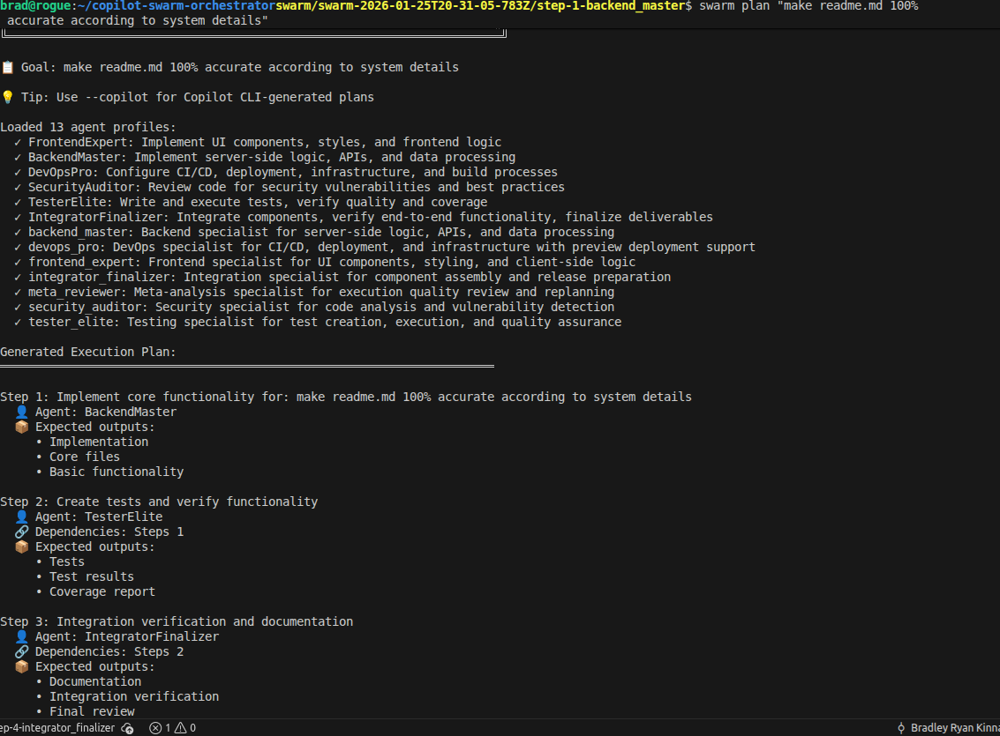
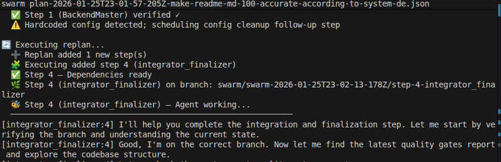

<p align="center">
  
</p>

<h1 align="center">Copilot Swarm Orchestrator</h1>

<p align="center">
<strong>Parallel AI workflow engine for GitHub Copilot CLI.</strong><br>
Turn a goal into a dependency-aware execution plan, run multiple Copilot agents simultaneously on isolated git branches, verify every step from transcript evidence, and merge the results.
</p>

<p align="center">
<a href="LICENSE"></a>
<a href="https://nodejs.org/"></a>
<a href="https://www.typescriptlang.org/"></a>
<a href="#test-suite"></a>
<a href="#project-stats"></a>
</p>

<p align="center">
<a href="#quickstart">Quickstart</a>&nbsp;&nbsp;|&nbsp;&nbsp;<a href="#demos">Demos</a>&nbsp;&nbsp;|&nbsp;&nbsp;<a href="#how-it-works">How It Works</a>&nbsp;&nbsp;|&nbsp;&nbsp;<a href="#features">Features</a>&nbsp;&nbsp;|&nbsp;&nbsp;<a href="#recent-updates">Recent Updates</a>&nbsp;&nbsp;|&nbsp;&nbsp;<a href="#commands">Commands</a>&nbsp;&nbsp;|&nbsp;&nbsp;<a href="#configuration">Configuration</a>&nbsp;&nbsp;|&nbsp;&nbsp;<a href="#architecture">Architecture</a>&nbsp;&nbsp;|&nbsp;&nbsp;<a href="#contributing">Contributing</a>
</p>

---

<br>

## Quickstart

```bash
git clone https://github.com/moonrunnerkc/copilot-swarm-orchestrator.git
cd copilot-swarm-orchestrator
npm install && npm run build
```

Run a two-step parallel demo in under 30 seconds:

```bash
npm start demo-fast
```

Or build an analytics dashboard with four agents across three waves:

```bash
npm start demo dashboard-showcase
```

**Prerequisites:** Node.js 18+, Git, and [GitHub Copilot CLI](https://docs.github.com/en/copilot/github-copilot-in-the-cli) installed and authenticated (`gh copilot`).

<br>

---

## Usage & Cost

> **Every agent step consumes its own premium request. A plan with 6 agents uses a minimum of 6 premium requests — one per agent.**

The orchestrator invokes `copilot -p` as a standalone subprocess for every step in your plan. There is no session reuse or batching — each agent is an independent Copilot CLI process. When agents run in parallel within a wave, each one simultaneously consumes a premium request. This means:

| Scenario | Steps | Min requests (happy path) | Max requests (all retries + repairs) |
|:---------|------:|:-------------------------:|:------------------------------------:|
| `demo-fast` | 2 | 2 | ~14 |
| `dashboard-showcase` | 4 | 4 | ~28 |
| `api-server` | 6 | 6 | ~42 |
| `saas-mvp` | 8 | 8 | ~56 |

**Where the multiplier comes from:**

- **Retries on failure:** up to 3 automatic retries per step (exponential backoff).
- **Repair Agent:** if verification fails, the Repair Agent spawns up to 3 additional Copilot sessions with accumulated context.
- **Fallback re-execution:** if all repair attempts fail, the step is re-executed from scratch.

In practice, most steps succeed on the first attempt, so actual usage clusters near the minimum. The adaptive concurrency system also backs off when it detects rate-limit (429) responses.

**To minimize usage:**

- Start with `demo-fast` (2 requests) to verify your setup.
- Use `--skip-verify` to avoid repair loops during experimentation (not recommended for production runs).
- Review your plan before execution with `--pm` — the PM Agent catches broken dependency graphs that would cause wasted retries.
- Monitor your [Copilot usage dashboard](https://github.com/settings/copilot) to track consumption.

<br>

---

## Demos

Six built-in scenarios let you see the orchestrator in action without writing a plan. Each creates a temp directory, runs real Copilot CLI sessions, and produces a working project with a clean git history.

| Scenario | Agents | Waves | What gets built | Time |
|:---------|:------:|:-----:|:----------------|-----:|
| `demo-fast` | 2 | 1 | Two independent utility modules (parallel proof) | ~30 sec |
| `dashboard-showcase` | 4 | 3 | React + Chart.js analytics dashboard, Express API, dark theme, ~15 tests | ~6 min |
| `todo-app` | 4 | 3 | React todo app with Express backend and test suite | ~15 min |
| `api-server` | 6 | 4 | REST API with JWT auth, PostgreSQL/Prisma, Docker, CI/CD | ~25 min |
| `full-stack-app` | 7 | 5 | Full-stack todo with auth, Playwright E2E, Docker, CI/CD | ~30 min |
| `saas-mvp` | 8 | 5 | SaaS MVP with Stripe payments, analytics, security audit, deployment | ~40 min |

```bash
npm start demo list          # see all scenarios
npm start demo <name>        # run one
```

<details>
<summary><strong>Watch a live run (YouTube)</strong></summary>
<br>

<a href="https://youtu.be/5m-6yxnDjk4">youtu.be/5m-6yxnDjk4</a>

</details>

<details>
<summary><strong>Screenshots</strong></summary>
<br>

| Agents executing in parallel | Wave completion summary |
|:----------------------------:|:----------------------:|
|  |  |

</details>

<details>
<summary><strong>Pre-baked example run</strong></summary>
<br>

If you want to inspect real output without running Copilot, the `examples/completed-run/` directory contains a full `demo-fast` execution including plans, metrics, and raw `/share` transcripts.

</details>

<br>

### Output Quality

The `dashboard-showcase` demo typically produces 10-12 source files (React 18, Vite 5, Express 4, Chart.js 4) that pass these checks out of the box:

- **Build**: `vite build` completes with zero warnings
- **Tests**: ~15 passing (unit + API integration) using the Node.js built-in test runner
- **Accessibility**: semantic HTML (`<nav>`, `<main>`, `<header>`, `<section>`, `<article>`), 12+ ARIA attributes, `:focus-visible` focus styles, `aria-live` for dynamic content
- **Responsive**: two CSS breakpoints (1024px sidebar collapse, 640px single column)
- **Error handling**: React ErrorBoundary, fetch error banner with retry, loading states
- **Documentation**: generated README with install, run, test instructions and architecture overview

Every agent commit is verified against its transcript before merging. No unverified code reaches main.

<br>

---

## How It Works

```
Goal ──▸ Plan ──▸ Waves ──▸ Branches ──▸ Agents ──▸ Verify ──▸ Repair? ──▸ Critic ──▸ Merge
```

1. **Plan generation.** A goal becomes a set of numbered steps, each assigned to a specialized agent with declared dependencies. Steps can target different repositories via the optional `repo` field. Plans can be generated interactively, imported from a Copilot transcript, loaded from a template, or bootstrapped from repo analysis.

2. **Wave scheduling.** The dependency graph is topologically sorted into waves. Steps within a wave have no mutual dependencies and run simultaneously. Adaptive concurrency adjusts limits based on success rates and rate-limit signals. In lean mode, the knowledge base is scanned pre-wave for similar past tasks and reference blocks are appended to prompts.

3. **Branch isolation.** Each step gets its own git branch (`swarm/<run-id>/step-N-agent`). With `--strict-isolation`, isolation is enforced per task (not just per wave) and cross-wave context is restricted to entries with verified transcript evidence only.

4. **Copilot execution.** The orchestrator invokes `copilot -p` as a subprocess for each step, injecting the agent prompt plus dependency context from previously completed steps. Transcripts are captured via the `/share` export.

5. **Evidence-based verification.** The verifier engine parses each transcript looking for concrete evidence: git commit SHAs, test runner output (Jest, Mocha, pytest, Node.js test runner, Go, Cargo), build success markers, and file-change records. Claims made by the agent are cross-referenced against this evidence. Unverified claims generate warnings; missing required evidence fails the step.

6. **Critic review.** When `--governance` is enabled, a Critic wave runs after step execution and before merge. The Critic reviews diffs and transcripts against the original plan and quality gates, producing an advisory score (0-100), a list of flags, and a recommendation (approve/reject/revise). Scores are heuristic indicators, not authoritative judgments -- final merge decisions rest with the human operator. Any flags trigger an auto-pause for human approval.

7. **Self-repair.** Failed steps are retried up to three times by the Repair Agent. Before each retry, the failure is classified (build, test, missing-artifact, dependency, timeout, or general) and a targeted repair strategy is selected. Each retry receives the original task, the failure classification with class-specific evidence, the verification failure details, a root-cause analysis, the prior transcript, and the git diff. Context accumulates across attempts.

8. **Merge.** Verified branches merge back to main in wave order to preserve a clean, linear-ish commit history. For multi-repo plans, each repo group is verified independently before cross-repo verification and final merge.

<br>

---

## Features

### Parallel Execution Engine
The core scheduler runs independent steps concurrently with dependency-aware wave grouping. An adaptive concurrency manager starts at a configurable limit (default 3), raises it after five consecutive successes, and halves it on rate-limit responses. The wave resizer splits oversized waves and merges undersized ones dynamically.

### Multi-Repo Orchestration
Plan steps can target different repositories via an optional `repo` field (git URL or local path; defaults to cwd). The orchestrator groups steps by repo, runs isolated wave loops per group, performs cross-repo verification after all groups complete, and merges results. The dashboard displays per-repo progress.

### Persistent Sessions and Audit
Full execution state (dependency graph, branch map, transcripts, metrics, gate results, status) is persisted per session ID in JSON under `runs/<id>/`. Sessions can be resumed from the last completed step with `--resume <SESSION-ID>`. The `audit` subcommand and `GET /api/audit/:sessionId` endpoint generate Markdown reports with timeline, diffs summary, cost breakdown, gate results, and evidence.

### Governance Mode (Critic Agent)
The `--governance` flag inserts a Critic review wave after step execution and before merge. The Critic scores each step by grouping verification checks by type and applying weighted deductions: build (-25), test (-20), commit (-10), lint (-5), claim (-5). Flags include the check type, count, and first failure reason (e.g., `"step-3: 2/3 test checks failed (assertion error)"`). The resulting advisory score (0-100) drives a recommendation: approve (no flags), revise (score >= 60 with flags), or reject (score < 60). Scores are heuristic indicators, not authoritative judgments -- final merge decisions rest with the human operator. Any flags trigger an auto-pause for human approval. The dashboard shows per-axis breakdown and flag detail per step.

### Strict Isolation
The `--strict-isolation` flag forces one git branch per task (rather than per wave). Cross-wave context is restricted to entries with non-empty transcript fields (verified evidence only); entries backed only by shared mutable state are rejected.

### Lean Mode (Delta Context Engine)
The `--lean` flag enables pre-wave knowledge base scanning. Before each wave, stored patterns are compared to current step descriptions using keyword overlap and normalized Levenshtein similarity (default threshold: 0.7). Matching patterns produce reference blocks appended to prompts (e.g., `"Reference: similar task completed in session <id>, commit <sha>."`). The metrics collector tracks saved requests, and the dashboard displays the count and estimated savings when lean mode is active.

### Eight Agent Profiles
Six step-executing agents (FrontendExpert, BackendMaster, TesterElite, SecurityAuditor, DevOpsPro, IntegratorFinalizer) plus a Repair Agent for self-healing and a PM Agent for pre-execution plan review. Each agent has a defined purpose, scope boundaries, done-definitions, and refusal rules. Custom agents are supported through `config/user-agents.yaml`.

### Transcript Verification
The share parser extracts structured data from Copilot `/share` transcripts: files changed, commands executed, test results, git commits, package operations, build and lint output, and MCP evidence sections. The verifier engine uses this to confirm each step actually did what it claimed.

### Quality Gates
Six automated checks run against generated projects: scaffold-default removal, duplicate code detection, hardcoded config detection, README claim verification, test isolation validation, and runtime checks (test execution, linting, security audit). Configurable via `config/quality-gates.yaml`. When a gate fails, the orchestrator can auto-inject follow-up steps to fix the issue.

### Plan Review (PM Agent)
Before execution begins, the PM Agent validates the plan for duplicate step numbers, circular dependencies, unknown agents, non-existent dependency references, and missing integration steps. Available via the `--pm` flag.

### Bootstrap from Existing Repos
The `bootstrap` command performs deep analysis of one or more repositories (languages, build scripts, dependencies, tech debt markers), fetches related GitHub issues, identifies cross-repo relationships, and generates an annotated execution plan with provenance links.

### Human-in-the-Loop Steering
During execution, operators can issue real-time commands: `pause`, `resume`, `approve`, `reject`. All steering actions are logged to an audit trail. A conflict approval queue handles cases where parallel agents produce overlapping changes. Read-only mode is supported for observation without intervention.

### Knowledge Base
A persistent JSON store captures execution patterns across runs. High-confidence patterns (dependency ordering, anti-patterns, best practices, failure modes) inform future planning. The knowledge base prunes stale entries and tracks occurrence frequency for confidence scoring. In lean mode, the KB is queried pre-wave to find similar past tasks and append reference blocks to prompts.

### Web Dashboard
A browser-based viewer (default port 3002) for inspecting past execution runs. Dark theme, single self-contained HTML page, no build step or extra dependencies.

- **Metrics panel**: total time, step count, wave count, commit count, pass rate, and agents used, displayed as a stat bar at the top of each run
- **Step status badges**: each step shows an inline PASS/FAIL badge derived from verification reports and wave analysis
- **Wave analysis**: per-wave health indicator (healthy/degraded/critical), step-level pass/fail chips, and detected pattern severity
- **Learned patterns**: knowledge base entries from the run, showing category, confidence, insight text, and supporting evidence
- **Collapsible sections**: verification reports and transcripts default to collapsed; click to expand
- **Copy button**: one-click clipboard copy on every transcript and verification report
- **Auto-refresh**: toggle in the header polls the API every 5 seconds so you can watch a run complete in real time

```bash
npm start web-dashboard        # http://localhost:3002
npm start web-dashboard 8080   # custom port
```

### Plan Templates
Five starter plans for common project types (REST API, React app, CLI tool, full-stack app, library) with pre-configured agent assignments and dependency graphs. Run `npm start templates` to browse them.

### Plan Caching + Replay
The `--plan-cache` flag scans stored plans for a goal match above a 0.85 similarity threshold using keyword overlap (Jaccard) and normalized Levenshtein distance. On a cache hit, the cached plan template is reused with an updated timestamp, skipping the `generateIntelligentSteps` call. On a miss, planning proceeds normally. The `--replay` flag checks the knowledge base before each step for a matching task + agent with a verified transcript. On a match, the transcript is copied to the current step directory and the Copilot session is skipped entirely. Non-matching steps proceed normally. Both flags are opt-in and independent.

### Failure-Classified Repair
Before selecting a repair strategy, the Repair Agent classifies each failure into one of six categories based on check tags and root cause text: `build-failure`, `test-failure`, `missing-artifact`, `dependency-error`, `timeout`, or `general`. Each category maps to targeted instructions: build failures direct the agent to fix specific compiler errors at the reported file and line; test failures list the failing test names and instruct the agent to fix the implementation without modifying tests; missing-artifact failures list the expected files to create; dependency errors instruct the agent to install or fix packages; timeouts instruct the agent to simplify to the minimum viable deliverable. The repair prompt includes a `FAILURE CLASSIFICATION` section with the class label and class-specific evidence.

### Deployment Rollback
When `--confirm-deploy` is active, the orchestrator wraps the deployment in a tag-deploy-verify-rollback cycle. Before deploying, HEAD is tagged with `pre-deploy/<execution-id>`. After deployment, an HTTP health check runs against the preview URL (default: 3 retries, 20-second intervals). If the health check passes, execution continues. If it fails, the orchestrator reverts HEAD via `git revert --no-commit` and creates a rollback commit, then logs the event to the audit trail.

<br>

---

## Recent Updates

Nine upgrades shipped across two cycles. No new dependencies were added.

**v3.0.0 (Upgrades 7-10)**

- **Plan template caching.** `--plan-cache` skips the Copilot planning call when a stored plan matches the goal above a 0.85 similarity threshold (keyword overlap + normalized Levenshtein). `--replay` reuses a prior verified transcript for identical steps, skipping the Copilot session entirely.
- **Analysis-augmented critic.** The governance critic now scores per check axis (test: -20, build: -25, lint: -5, commit: -10, claim: -5) instead of a flat -15 per failure. Flags include check type and count. The dashboard shows per-axis breakdown.
- **Failure-classified repair.** The repair agent classifies failures as build, test, missing-artifact, dependency, or timeout before selecting a targeted repair strategy. Each class gets focused instructions and evidence injection.
- **Deployment rollback.** When `--confirm-deploy` is active, the orchestrator tags HEAD before deploy, runs an HTTP health check against the preview URL (3 retries, 20s interval), and auto-reverts on failure.

**v2.0.0 (Upgrades 1-6)**

- **Multi-repo orchestration.** Plan steps accept an optional `repo` field. The orchestrator groups steps by repository, runs isolated wave loops per group, performs cross-repo verification, and merges results. The dashboard shows per-repo progress.
- **Persistent sessions and audit.** Full execution state is saved per session ID. `--resume <SESSION-ID>` continues from the last completed step. `swarm audit <SESSION-ID>` and `GET /api/audit/:sessionId` produce Markdown audit reports with timeline, cost breakdown, gates, and evidence.
- **Governance mode.** `--governance` inserts a Critic review wave after step execution and before merge. The Critic produces an advisory score (0-100), flags drift or quality issues, and recommends approve/reject/revise. Scores are heuristic, not authoritative; final decisions rest with the operator. Flags trigger auto-pause for human approval.
- **Strict isolation.** `--strict-isolation` forces per-task branching and restricts cross-wave context to entries with verified transcript evidence, rejecting shared mutable state.
- **Lean mode.** `--lean` scans the knowledge base pre-wave for similar past tasks using keyword overlap and normalized Levenshtein distance (threshold 0.7). Matches produce reference blocks appended to prompts. Metrics track saved requests and the dashboard displays the count.

<br>

---

## Commands

After building (`npm run build`), use `npm start` or the global `swarm` command:

| Command | Description |
|:--------|:------------|
| `npm start demo-fast` | Two-step parallel demo (~30 sec) |
| `npm start demo <scenario>` | Run a named demo scenario |
| `npm start demo list` | List all 6 demo scenarios |
| `npm start plan "goal"` | Generate an execution plan from a goal |
| `npm start swarm plan.json` | Execute a plan with parallel agents |
| `npm start swarm plan.json --pm` | Execute with PM Agent plan review first |
| `npm start run --goal "goal"` | Generate plan and execute in one step |
| `npm start quick "task"` | Single-agent quick task |
| `npm start bootstrap ./repo "goal"` | Analyze repo(s) and generate a plan |
| `npm start gates [path]` | Run quality gates on a project |
| `npm start audit <session-id>` | Generate Markdown audit report for a session |
| `npm start metrics <session-id>` | Show metrics summary (supports `--json`) |
| `npm start web-dashboard [port]` | Start the web dashboard (default: 3002) |
| `npm start templates` | List available plan templates |
| `npm start status <id>` | Check execution status |

**Flags:**

| Flag | Effect |
|:-----|:-------|
| `--pm` | Enable PM Agent plan review before execution |
| `--model <name>` | Override the Copilot model |
| `--governance` | Enable advisory Critic review wave with scoring and auto-pause |
| `--strict-isolation` | Force per-task branching; restrict context to transcript evidence |
| `--lean` | Enable Delta Context Engine (KB-backed prompt references) |
| `--resume <session-id>` | Resume a previously paused or failed session |
| `--skip-verify` | Skip transcript verification (not recommended) |
| `--no-quality-gates` | Disable quality gate checks |
| `--confirm-deploy` | Allow deployment steps to execute with tag/health-check/rollback (opt-in) |
| `--plan-cache` | Skip planning when a cached plan template matches (>85% similarity) |
| `--replay` | Reuse prior verified transcript for identical steps (skip Copilot call) |
| `--mcp` | Enable MCP integration |
| `--quality-gates-config <path>` | Custom quality gates config file |

**Example: full-featured run**

```bash
npm start swarm plan.json --governance --lean --strict-isolation --pm
```

**Example: plan and execute in one step**

```bash
npm start run --goal "Build a REST API with JWT auth" --lean --governance
```

**Example: plan with caching**

```bash
npm start plan "Build a CLI tool" --plan-cache
```

> **Note:** When using `npm start`, flags are passed through automatically. If npm warns about an unknown flag, use the `--` separator: `npm start -- plan "goal" --plan-cache`. This is not needed with the global `swarm` command.

<br>

---

## Installation

### From Source

```bash
git clone https://github.com/moonrunnerkc/copilot-swarm-orchestrator.git
cd copilot-swarm-orchestrator
npm install
npm run build
```

### One-Liner

```bash
curl -fsSL https://raw.githubusercontent.com/moonrunnerkc/copilot-swarm-orchestrator/main/install.sh | bash
```

### Global Install

```bash
npm link
swarm demo-fast    # now available as 'swarm' globally
```

### Requirements

- **Node.js 18+**
- **GitHub Copilot CLI** installed and authenticated (`gh copilot`)
- **Git** 2.20+ (for worktree support)

<br>

---

## Configuration

### Agent Profiles

Agent behavior is defined in YAML config files under `config/`:

| File | Purpose |
|:-----|:--------|
| `default-agents.yaml` | Six built-in step-executing agents |
| `repair-agent.yaml` | Repair Agent for failed-step retries |
| `pm-agent.yaml` | PM Agent for plan validation |
| `user-agents.yaml` | Your custom agents (template included) |

Each agent profile specifies purpose, scope, boundaries, done-definitions, output contracts, and refusal rules. Add custom agents by editing `user-agents.yaml`:

```yaml
agents:
  - name: MyAgent
    purpose: "What this agent does"
    scope:
      - "Area of responsibility"
    boundaries:
      - "What it should not touch"
    done_definition:
      - "Completion criteria"
```

### Quality Gates

Quality gate behavior is configured in `config/quality-gates.yaml`. You can enable/disable individual gates, set thresholds (minimum duplicate lines, max occurrences), and toggle auto-remediation:

```yaml
enabled: true
failOnIssues: true
autoAddRefactorStepOnDuplicateBlocks: true
autoAddReadmeTruthStepOnReadmeClaims: true

gates:
  duplicateBlocks:
    enabled: true
    minLines: 12
    maxOccurrences: 2
```

<br>

---

## Architecture

### Execution Flow

```
                     ┌─────────────────────┐
                     │     Goal / Plan      │
                     └──────────┬───────────┘
                                │
                     ┌──────────▼───────────┐
                     │   PM Agent Review    │  (optional --pm flag)
                     └──────────┬───────────┘
                                │
                     ┌──────────▼───────────┐
                     │  Multi-Repo Grouping │  (optional repo field)
                     └──────────┬───────────┘
                                │
                     ┌──────────▼───────────┐
                     │   Wave Scheduler     │  topological sort + lean KB scan
                     └──────────┬───────────┘
                                │
              ┌─────────────────┼─────────────────┐
              │                 │                  │
     ┌────────▼──────┐  ┌──────▼───────┐  ┌──────▼───────┐
     │  Agent on     │  │ Agent on    │   │ Agent on     │
     │  branch step-1│  │branch step-2│   │ branch step-3│
     └────────┬──────┘  └──────┬───────┘  └──────┬───────┘
              │                 │                  │
     ┌────────▼──────┐  ┌──────▼───────┐  ┌──────▼───────┐
     │   Verifier    │  │   Verifier   │  │   Verifier   │
     └────────┬──────┘  └──────┬───────┘  └──────┬───────┘
              │                 │                  │
              │     ┌───────────▼──────────┐      │
              └────▸│   Repair Agent       │◂─────┘  (retry loop, up to 3x)
                    └───────────┬──────────┘
                                │
                    ┌───────────▼──────────┐
                    │   Critic Review      │         (optional --governance)
                    └───────────┬──────────┘
                                │
                    ┌───────────▼──────────┐
                    │   Merge to main      │
                    └───────────┬──────────┘
                                │
                     ┌──────────▼───────────┐
                     │   Quality Gates      │  (6 automated checks)
                     └──────────┬───────────┘
                                │
                     ┌──────────▼───────────┐
                     │   Meta Analyzer      │  health + pattern detection
                     └──────────────────────┘
```

### Key Modules

| Module | Lines | Responsibility |
|:-------|------:|:---------------|
| `swarm-orchestrator.ts` | 1,999 | Parallel execution engine, wave management, multi-repo grouping, governance, lean mode, replay, merge orchestration |
| `cli.ts` | 1,451 | Command parsing, demo runner, plan import, audit/metrics/run subcommands, --plan-cache/--replay flags, all user-facing entry points |
| `plan-generator.ts` | 743 | Plan creation, dependency validation, Copilot-assisted generation, plan-cache short-circuit |
| `share-parser.ts` | 673 | Transcript parsing: files, commands, tests, commits, claims, MCP evidence |
| `demo-mode.ts` | 660 | Six demo scenarios with full agent prompts and expected outputs |
| `dashboard.tsx` | 547 | TUI dashboard with real-time progress, repo status, per-axis critic scores, lean savings display |
| `verifier-engine.ts` | 476 | Evidence checking against transcripts, verification report generation |
| `session-executor.ts` | 461 | Copilot CLI subprocess management, transcript capture |
| `step-runner.ts` | 432 | Single-step execution with branch setup, context injection, cleanup |
| `repo-analyzer.ts` | 354 | Codebase scanning for languages, deps, build scripts, tech debt |
| `config-loader.ts` | 350 | YAML agent profile loading with validation and merge |
| `quick-fix-mode.ts` | 319 | Single-agent quick task runner |
| `repair-agent.ts` | 406 | Self-repair loop with failure classification, targeted strategies, context accumulation (up to 3 retries) |
| `copilot-cli-wrapper.ts` | 315 | CLI wrapper with strict isolation guard and degraded fallback |
| `context-broker.ts` | 313 | Shared state, git locking, dependency context injection, strict isolation filter |
| `pm-agent.ts` | 303 | Plan validation: cycles, unknown agents, stale metadata |
| `meta-analyzer.ts` | 305 | Wave health scoring, pattern detection, replan decisions |
| `knowledge-base.ts` | 289 | Persistent cross-run pattern storage, Levenshtein similarity, findSimilarTasks |
| `steering-router.ts` | 290 | Human-in-the-loop commands during execution |
| `deployment-manager.ts` | 249 | Preview deployment, tag/health-check/rollback cycle, deployment metadata persistence |
| `web-dashboard.ts` | 170 | Express server, audit API endpoint, runs viewer |
| `metrics-collector.ts` | 182 | Metrics tracking, session save/load, audit report generation |
| `wave-resizer.ts` | 164 | Adaptive wave splitting, merging, and concurrency adjustment |

**Total: 66 source files, 16,489 lines of TypeScript.**

### Output Artifacts

Each execution produces an audit trail alongside your project code:

```
runs/<execution-id>/
  session-state.json                    # full execution state (resumable)
  metrics.json                          # timing, commit count, verification stats
  knowledge-base.json                   # patterns learned from this run
  wave-N-analysis.json                  # per-wave health assessment
  steps/
    step-1/share.md                     # raw Copilot transcript
    step-2/share.md
  verification/
    step-1-verification.md              # evidence-based pass/fail report
    step-2-verification.md
```

Generate a Markdown audit report for any session:

```bash
npm start audit <session-id>
```

For non-demo runs (inside your own repo), add to `.gitignore`:

```
plans/
runs/
proof/
.quickfix/
```

<br>

---

## Test Suite

563 tests across 45 test files covering the full system:

```bash
npm test
# 563 passing (9s)
# 1 pending
```

Tests validate plan generation, wave scheduling, transcript parsing, verification logic, conflict resolution, quality gates, agent configuration loading, metrics collection, knowledge-base persistence and similarity search, session save/load round-trips, audit report generation, CLI flag parsing, governance critic scoring (per-axis weighted deductions), strict isolation context filtering, multi-repo grouping, failure-classified repair strategies, plan cache similarity matching, deployment rollback with health checks, and every demo scenario definition.

<br>

---

## Project History

This project started as a submission for the **GitHub Copilot CLI Challenge** in early 2026. What began as a basic parallel runner has grown into a comprehensive orchestration system with self-repair, adaptive scheduling, quality gates, and persistent learning across runs. Development is ongoing with regular updates and new capabilities being added.

<br>

---

## Roadmap

Active development areas:

- Visual dashboard improvements for real-time execution monitoring
- Additional plan templates for more project types
- Enhanced MCP integration for tighter GitHub workflow coupling
- Performance profiling and execution time optimization
- Plugin system for custom verification checks and quality gates

<br>

---

## Contributing

Contributions are welcome. The codebase is TypeScript with strict mode enabled, targeting ES2020.

```bash
npm install          # install dependencies
npm run build        # compile TypeScript
npm test             # run all 563 tests
```

Before submitting a PR:
1. Run `npm test` and confirm all tests pass
2. Run `npm start gates .` to check quality gates against your changes
3. Keep commit messages descriptive and incremental

<br>

---

## License

[ISC](LICENSE)

Built by [Bradley R. Kinnard](https://github.com/moonrunnerkc).

<p align="center">
  
</p>
