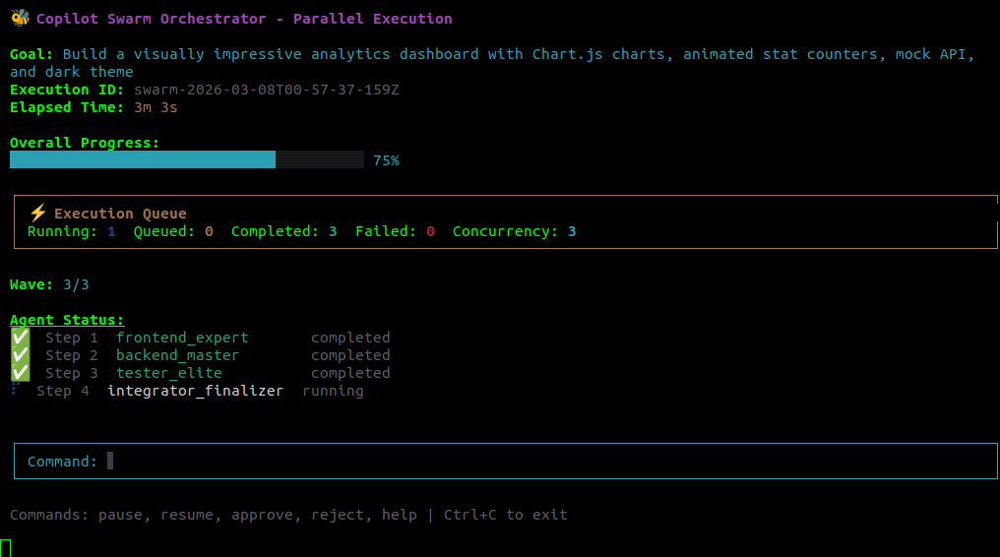

<div align="center">

<br>

<p>
  
  
  
  
  
</p>

# Copilot Swarm Orchestrator

**Verified, quality-gated orchestration for GitHub Copilot CLI. Every agent proves its work before anything merges.**

<br>

[](LICENSE)
&nbsp;&nbsp;

&nbsp;&nbsp;

&nbsp;&nbsp;


<br>

[Quick Start](#quick-start) · [What Is This](#what-is-this) · [Features](#features) · [Installation](#installation) · [Usage](#usage) · [Architecture](#architecture) · [Contributing](#contributing)

<br>



<br>

</div>

---

<br>

## Quick Start

```bash
git clone https://github.com/moonrunnerkc/copilot-swarm-orchestrator.git
cd copilot-swarm-orchestrator
npm install && npm run build
npm start demo-fast
```

That runs a two-step parallel demo in about a minute. Requires Node.js 18+, Git, and GitHub Copilot CLI installed and authenticated (`gh copilot`).

<br>

---

<br>

## What Is This

AI coding agents produce code fast. The problem is knowing whether that code actually works before it reaches your codebase. This orchestrator exists to answer that question with evidence, not assumptions.

Every agent runs on its own isolated git branch. Every claim an agent makes is cross-referenced against its Copilot session transcript for concrete evidence: commit SHAs, test output, build results, file changes. Steps that can't prove their work don't merge. Steps that fail get classified, repaired with targeted strategies, and re-verified. After merge, six automated quality gates check the generated code for scaffold leftovers, duplicate blocks, hardcoded config, README claim accuracy, test isolation, and runtime correctness. Nothing reaches main without passing through both the verification engine and the quality gate pipeline.

The orchestrator wraps `copilot -p` (or `/fleet` for native parallel subagent dispatch) as an independent subprocess per step. It runs outside of Copilot's own execution model. You define a goal, it builds a dependency graph, launches steps as dependencies resolve, and manages the full lifecycle: branch creation, agent execution, transcript capture, evidence verification, failure repair, governance review, cost tracking, and merge. The entire execution produces an auditable trail of transcripts, verification reports, and cost attribution that you can inspect after every run.

Before execution begins, the cost estimator predicts premium request consumption based on the plan, model multipliers, and historical failure rates from the knowledge base. You can preview the estimate, set a hard budget, or run without limits.

Started as a submission for the GitHub Copilot CLI Challenge in early 2026 and has grown into a verification, cost governance, and quality gate system for Copilot CLI runs.

<br>

## Features

- **Evidence-based verification** parsing Copilot `/share` transcripts for commit SHAs, test output, build markers, and file changes. No unverified code merges.
- **Quality gates** checking for scaffold leftovers, duplicate code, hardcoded config, README claim drift, test isolation, and runtime correctness
- **Failure-classified repair** categorizing failures (build, test, missing-artifact, dependency, timeout) and applying targeted fix strategies, up to 3 retries with accumulating context
- **Governance mode** with a Critic agent that scores steps on weighted axes (build, test, lint, commit, claim) and auto-pauses on flags for human approval
- **Strict isolation** forcing per-task branching with cross-wave context restricted to transcript-verified entries only
- **Human-in-the-loop steering** with pause, resume, approve, reject commands and a conflict approval queue
- **Pre-execution cost estimation** predicting premium request consumption per step, factoring in model multipliers (1x for claude-sonnet-4/gpt-4o, 5x for o4-mini, 20x for o3), retry probability from historical failure rates, and overage cost at $0.04 per request over allowance
- **Per-step cost attribution** recording estimated vs actual premium requests, retry counts, prompt tokens, and fleet mode per step, saved to `cost-attribution.json` alongside metrics
- **Greedy as-soon-as-ready scheduling** launching steps the moment their dependencies are satisfied (not when an entire wave finishes), with event-driven dependency resolution, adaptive concurrency, and octopus merge for multi-branch completion
- **Fleet wrapper mode** (`--wrap-fleet`) prefixing step prompts with `/fleet` for Copilot CLI's native parallel subagent dispatch, with version detection and automatic fallback
- **Multi-repo orchestration** with per-repo wave loops, cross-repo verification, and grouped merge
- **Eight agent profiles** (six executing, one repair, one PM) with YAML-defined scope, boundaries, done-definitions, and refusal rules; custom agents supported
- **Persistent sessions** with resume from last completed step, full audit trail, and Markdown report generation
- **Lean mode (Delta Context Engine)** scanning the knowledge base pre-wave for similar past tasks and appending reference blocks to prompts
- **Plan caching and replay** reusing stored plans above 0.85 similarity, or replaying prior verified transcripts for identical steps
- **Deployment rollback** with tag-deploy-verify-rollback cycle and HTTP health checks
- **Knowledge base** capturing execution patterns and cost history across runs for confidence-scored future planning and cost calibration
- **Web dashboard** (single HTML page, dark theme, no build step) with real-time auto-refresh, step badges, wave health, learned patterns, and cost attribution panel with sortable per-step breakdown

<br>

---

<br>

## Installation

### Prerequisites

| Requirement | Version |
|-------------|---------|
| Node.js | 18+ |
| Git | 2.20+ (worktree support) |
| GitHub Copilot CLI | Installed and authenticated (`gh copilot`) |

### From Source

```bash
git clone https://github.com/moonrunnerkc/copilot-swarm-orchestrator.git
cd copilot-swarm-orchestrator
npm install
npm run build
```

### One-Liner

```bash
curl -fsSL https://raw.githubusercontent.com/moonrunnerkc/copilot-swarm-orchestrator/main/install.sh | bash
```

### Global Install

```bash
npm link
swarm demo-fast    # now available as 'swarm' globally
```

### Copilot CLI Plugin (Lightweight)

For agents, skills, and quality gates without the full orchestrator:

```bash
copilot /plugin install moonrunnerkc/copilot-swarm-orchestrator
```

This installs six specialized agent profiles, three skills (orchestrate, verify, gates), and scope enforcement hooks into your Copilot CLI environment. Scope enforcement hooks detect file operations outside the agent's declared scope and log them as scope violations. Violations are enforced at the verification layer: any step with scope violations fails verification. Direct execution-time blocking is planned for a future Copilot CLI SDK update. Use `/agents list` to see the installed agents, and `/swarm gates` to run quality checks from within a Copilot CLI session.

The plugin is the lightweight entry point. For full parallel wave scheduling, cost governance, repair pipeline, and the web dashboard, use the full source install above.

<br>

---

<br>

## Usage

### Demos

Six built-in scenarios that create a temp directory, run real Copilot CLI sessions, and produce a working project with clean git history.

| Scenario | Agents | Waves | What gets built | Time |
|----------|--------|-------|-----------------|------|
| `demo-fast` | 2 | 1 | Two independent utility modules (parallel proof) | ~1 min |
| `dashboard-showcase` | 4 | 3 | React + Chart.js analytics dashboard, Express API, dark theme, ~27 tests | ~8 min |
| `todo-app` | 4 | 3 | React todo app with Express backend and test suite | ~15 min |
| `api-server` | 6 | 4 | REST API with JWT auth, PostgreSQL/Prisma, Docker, CI/CD | ~25 min |
| `full-stack-app` | 7 | 5 | Full-stack todo with auth, Playwright E2E, Docker, CI/CD | ~30 min |
| `saas-mvp` | 8 | 5 | SaaS MVP with Stripe payments, analytics, security audit, deployment | ~40 min |

```bash
npm start demo list          # see all scenarios
npm start demo <name>        # run one
```

<details>
<summary><strong>Output quality</strong> (dashboard-showcase example)</summary>

<br>

The `dashboard-showcase` demo typically produces 9 source files and 3 test files (React 18, Vite 5, Express 4, Chart.js 4) totaling ~1,300 lines that pass these checks out of the box:

- **Build:** `vite build` completes with zero warnings
- **Tests:** ~27 passing (unit + API integration) using the Node.js built-in test runner
- **Accessibility:** semantic HTML, 20+ ARIA attributes, `:focus-visible` styles, `aria-live` for dynamic content, skip-to-content link
- **Responsive:** three CSS breakpoints (1440px wide layout, 1024px sidebar collapse, 640px single column)
- **Error handling:** React ErrorBoundary, fetch error banner with retry, loading skeletons, abort controller cleanup
- **Documentation:** generated README with install, run, test instructions and architecture overview

</details>

<br>

### Commands

| Command | Description |
|---------|-------------|
| `npm start demo-fast` | Two-step parallel demo (~1 min) |
| `npm start demo <scenario>` | Run a named demo scenario |
| `npm start demo list` | List all 6 demo scenarios |
| `npm start plan "goal"` | Generate an execution plan from a goal |
| `npm start swarm plan.json` | Execute a plan with parallel agents |
| `npm start run --goal "goal"` | Generate plan and execute in one step |
| `npm start quick "task"` | Single-agent quick task |
| `npm start bootstrap ./repo "goal"` | Analyze repo(s) and generate a plan |
| `npm start gates [path]` | Run quality gates on a project |
| `npm start audit <session-id>` | Generate Markdown audit report |
| `npm start metrics <session-id>` | Show metrics summary (supports `--json`) |
| `npm start web-dashboard [port]` | Start the web dashboard (default: 3002) |
| `npm start templates` | List available plan templates |
| `npm start status <id>` | Check execution status |

<br>

### Flags

| Flag | Effect |
|------|--------|
| `--pm` | Enable PM Agent plan review before execution |
| `--model <name>` | Override the Copilot model |
| `--governance` | Enable advisory Critic review wave with scoring and auto-pause |
| `--strict-isolation` | Force per-task branching; restrict context to transcript evidence |
| `--lean` | Enable Delta Context Engine (KB-backed prompt references) |
| `--resume <session-id>` | Resume a previously paused or failed session |
| `--skip-verify` | Skip transcript verification (not recommended) |
| `--no-quality-gates` | Disable quality gate checks |
| `--confirm-deploy` | Enable deployment steps with tag/health-check/rollback (opt-in) |
| `--plan-cache` | Skip planning when a cached plan template matches (>85% similarity) |
| `--replay` | Reuse prior verified transcript for identical steps |
| `--mcp` | Enable MCP integration |
| `--quality-gates-config <path>` | Custom quality gates config file |
| `--cost-estimate-only` | Print pre-execution cost estimate and exit without running |
| `--max-premium-requests <n>` | Abort if estimated premium requests exceed budget |
| `--wrap-fleet` | Prefix step prompts with `/fleet` for native parallel subagent dispatch |

<br>

### Examples

Full-featured run:

```bash
npm start swarm plan.json --governance --lean --strict-isolation --pm
```

Plan and execute in one step:

```bash
npm start run --goal "Build a REST API with JWT auth" --lean --governance
```

Plan with caching:

```bash
npm start plan "Build a CLI tool" --plan-cache
```

Preview cost before running:

```bash
npm start swarm plan.json --cost-estimate-only
```

Run with /fleet and a budget cap:

```bash
npm start swarm plan.json --wrap-fleet --max-premium-requests 30
```

> **Note:** When using `npm start`, flags pass through automatically. If npm warns about an unknown flag, use the `--` separator: `npm start -- plan "goal" --plan-cache`. Not needed with the global `swarm` command.

<br>

### Cost and Premium Requests

Every agent step consumes its own premium request, multiplied by the model's premium request multiplier (1x for claude-sonnet-4, gpt-4o, claude-opus-4; 5x for o4-mini; 20x for o3). A plan with 6 agents on a 1x model uses a minimum of 6 premium requests. When agents run in parallel within a wave, each one simultaneously consumes a request.

| Scenario | Steps | Min requests (1x model) | Max requests (all retries + repairs) |
|----------|-------|-------------------------|--------------------------------------|
| `demo-fast` | 2 | 2 | ~14 |
| `dashboard-showcase` | 4 | 4 | ~28 |
| `api-server` | 6 | 6 | ~42 |
| `saas-mvp` | 8 | 8 | ~56 |

The multiplier comes from up to 3 automatic retries per step (exponential backoff), the Repair Agent spawning up to 3 additional sessions on verification failure, and fallback re-execution if all repair attempts fail. In practice, most steps succeed on the first attempt.

<details>
<summary><strong>Pre-execution cost estimation and budgets</strong></summary>

<br>

Before running a plan, the cost estimator predicts premium request consumption:

```bash
swarm swarm plan.json --cost-estimate-only
```

This prints a breakdown showing per-step estimates, retry buffer based on historical failure rates from the knowledge base, model multiplier, and projected overage cost, then exits without executing.

To set a hard budget that aborts execution if the estimate exceeds it:

```bash
swarm swarm plan.json --max-premium-requests 20
```

After execution, per-step cost attribution (estimated vs actual requests, retry counts, prompt tokens, fleet mode, duration) is saved to `cost-attribution.json` in the run directory and displayed in the web dashboard.

</details>

To minimize usage: start with `demo-fast` (2 requests) to verify your setup, use `--cost-estimate-only` to preview costs before committing, review your plan with `--pm` before execution, and use `--skip-verify` during experimentation only.

<br>

### Configuration

Agent behavior is defined in YAML config files under `config/`:

| File | Purpose |
|------|---------|
| `default-agents.yaml` | Six built-in step-executing agents |
| `repair-agent.yaml` | Repair Agent for failed-step retries |
| `pm-agent.yaml` | PM Agent for plan validation |
| `user-agents.yaml` | Your custom agents (template included) |

Each profile specifies purpose, scope, boundaries, done-definitions, output contracts, and refusal rules. Add custom agents by editing `user-agents.yaml`:

```yaml
agents:
  - name: MyAgent
    purpose: "What this agent does"
    scope:
      - "Area of responsibility"
    boundaries:
      - "What it should not touch"
    done_definition:
      - "Completion criteria"
```

Quality gate behavior is configured in `config/quality-gates.yaml`:

```yaml
enabled: true
failOnIssues: true
autoAddRefactorStepOnDuplicateBlocks: true
autoAddReadmeTruthStepOnReadmeClaims: true

gates:
  duplicateBlocks:
    enabled: true
    minLines: 12
    maxOccurrences: 2
```

<br>

---

<br>

## Architecture

### Execution Flow

```
Goal ──> Plan ──> Waves ──> Branches ──> Agents ──> Verify ──> Repair? ──> Critic ──> Merge
```

1. **Plan generation.** A goal becomes numbered steps, each assigned to a specialized agent with declared dependencies. Plans can be generated interactively, imported from a transcript, loaded from a template, or bootstrapped from repo analysis.
2. **Greedy scheduling.** Steps launch the moment their dependencies are satisfied, not when an entire wave finishes. The context broker emits events on step completion; the scheduler picks up newly-ready steps immediately. Adaptive concurrency adjusts limits based on success rates and rate-limit signals. Completed branches merge in batches via octopus merge when possible (one merge commit instead of N).
3. **Branch isolation.** Each step gets its own git worktree and branch (`swarm/<run-id>/step-N-agent`). With `--strict-isolation`, cross-step context is restricted to transcript-verified entries only.
4. **Copilot execution.** The orchestrator invokes `copilot -p` as a subprocess for each step, injecting the agent prompt plus dependency context from completed steps. Transcripts are captured via `/share` export.
5. **Verification.** The verifier parses each transcript for concrete evidence: commit SHAs, test runner output, build markers, file-change records. Agent claims are cross-referenced against this evidence. Missing required evidence fails the step.
6. **Critic review** (with `--governance`). A Critic wave runs after execution, before merge. The Critic scores each step using weighted deductions (build: -25, test: -20, commit: -10, lint: -5, claim: -5), produces a recommendation (approve/reject/revise), and auto-pauses on any flags for human approval. Scores are advisory; final merge decisions rest with the operator.
7. **Self-repair.** Failed steps are retried up to three times. The Repair Agent classifies each failure (build, test, missing-artifact, dependency, timeout) and applies a targeted strategy. Context accumulates across attempts.
8. **Merge.** Verified branches merge to main in wave order. For multi-repo plans, each repo group is verified independently before cross-repo verification and final merge.

<br>

```
                     ┌─────────────────────┐
                     │     Goal / Plan      │
                     └──────────┬───────────┘
                                │
                     ┌──────────▼───────────┐
                     │   PM Agent Review    │  (optional --pm)
                     └──────────┬───────────┘
                                │
                     ┌──────────▼───────────┐
                     │  Multi-Repo Grouping │  (optional repo field)
                     └──────────┬───────────┘
                                │
                     ┌──────────▼───────────┐
                     │   Wave Scheduler     │  topological sort + lean KB scan
                     └──────────┬───────────┘
                                │
              ┌─────────────────┼─────────────────┐
              │                 │                  │
     ┌────────▼──────┐  ┌──────▼───────┐  ┌──────▼───────┐
     │  Agent on     │  │  Agent on    │  │  Agent on    │
     │  branch step-1│  │  branch step-2│  │  branch step-3│
     └────────┬──────┘  └──────┬───────┘  └──────┬───────┘
              │                 │                  │
     ┌────────▼──────┐  ┌──────▼───────┐  ┌──────▼───────┐
     │   Verifier    │  │   Verifier   │  │   Verifier   │
     └────────┬──────┘  └──────┬───────┘  └──────┬───────┘
              │                 │                  │
              │     ┌───────────▼──────────┐      │
              └────>│   Repair Agent       │<─────┘  (up to 3 retries)
                    └───────────┬──────────┘
                                │
                    ┌───────────▼──────────┐
                    │   Critic Review      │  (optional --governance)
                    └───────────┬──────────┘
                                │
                    ┌───────────▼──────────┐
                    │   Merge to main      │
                    └───────────┬──────────┘
                                │
                     ┌──────────▼───────────┐
                     │   Quality Gates      │  (6 automated checks)
                     └──────────┬───────────┘
                                │
                     ┌──────────▼───────────┐
                     │   Meta Analyzer      │  health + pattern detection
                     └──────────────────────┘
```

<br>

<details>
<summary><strong>Key modules</strong> (71 source files, 17,903 lines of TypeScript)</summary>

<br>

| Module | Lines | Responsibility |
|--------|-------|----------------|
| `swarm-orchestrator.ts` | ~2,000 | Greedy scheduler, event-driven dependency resolution, octopus merge, multi-repo grouping, governance, lean mode, replay, cost tracking, merge orchestration |
| `cli.ts` | 1,535 | Command parsing, demo runner, plan import, audit/metrics/run subcommands, cost estimate flags, all user-facing entry points |
| `plan-generator.ts` | 743 | Plan creation, dependency validation, Copilot-assisted generation, plan-cache short-circuit |
| `share-parser.ts` | 673 | Transcript parsing: files, commands, tests, commits, claims, MCP evidence |
| `demo-mode.ts` | 700 | Six demo scenarios with full agent prompts and expected outputs |
| `dashboard.tsx` | 558 | TUI dashboard with real-time progress, repo status, per-axis critic scores, lean savings |
| `verifier-engine.ts` | ~620 | Evidence checking against transcripts (accepts pre-parsed index to avoid double parse), verification report generation |
| `session-executor.ts` | 468 | Copilot CLI subprocess management, transcript capture, /fleet prompt wrapping |
| `step-runner.ts` | 432 | Single-step execution with branch setup, context injection, cleanup |
| `repo-analyzer.ts` | 354 | Codebase scanning for languages, deps, build scripts, tech debt |
| `config-loader.ts` | 350 | YAML agent profile loading with validation and merge |
| `repair-agent.ts` | 406 | Self-repair loop with failure classification, targeted strategies, context accumulation |
| `copilot-cli-wrapper.ts` | 315 | CLI wrapper with strict isolation guard and degraded fallback |
| `context-broker.ts` | ~340 | Shared state, EventEmitter-based step completion signaling, git locking, dependency context injection, strict isolation filter |
| `quick-fix-mode.ts` | 319 | Single-agent quick task runner |
| `pm-agent.ts` | 303 | Plan validation: cycles, unknown agents, stale metadata |
| `meta-analyzer.ts` | 305 | Wave health scoring, pattern detection, replan decisions |
| `knowledge-base.ts` | 289 | Persistent cross-run pattern storage (including cost history), Levenshtein similarity, findSimilarTasks |
| `steering-router.ts` | 290 | Human-in-the-loop commands during execution |
| `deployment-manager.ts` | 249 | Preview deployment, tag/health-check/rollback cycle, deployment metadata persistence |
| `cost-estimator.ts` | 208 | Pre-execution cost prediction with model multipliers, retry calibration, knowledge base integration |
| `web-dashboard.ts` | 507 | Express server, audit API endpoint, runs viewer, cost attribution panel |
| `metrics-collector.ts` | 182 | Metrics tracking, session save/load, audit report generation |
| `wave-resizer.ts` | 166 | Adaptive wave splitting, merging, and concurrency adjustment |
| `fleet-wrapper.ts` | 92 | /fleet prompt prefix, version detection, subagent count heuristic |

</details>

<details>
<summary><strong>Output artifacts</strong></summary>

<br>

Each execution produces an audit trail alongside your project code:

```
runs/<execution-id>/
  session-state.json                    # full execution state (resumable)
  metrics.json                          # timing, commit count, verification stats
  cost-attribution.json                 # per-step estimated vs actual premium requests
  knowledge-base.json                   # patterns learned from this run (including cost history)
  wave-N-analysis.json                  # per-wave health assessment
  steps/
    step-1/share.md                     # raw Copilot transcript
    step-2/share.md
  verification/
    step-1-verification.md              # evidence-based pass/fail report
    step-2-verification.md
```

Generate a Markdown audit report:

```bash
npm start audit <session-id>
```

For non-demo runs (inside your own repo), add to `.gitignore`:

```
plans/
runs/
proof/
.quickfix/
```

</details>

<br>

---

<br>

## Status

Actively maintained. 71 source files, 61 test files, 951 tests passing. Development is ongoing with regular updates.

See [Releases](https://github.com/moonrunnerkc/copilot-swarm-orchestrator/releases) for version history.

<br>

---

<br>

## Contributing

Contributions are welcome. The codebase is TypeScript with strict mode enabled, targeting ES2020.

```bash
npm install          # install dependencies
npm run build        # compile TypeScript
npm test             # run full test suite
```

Before submitting a PR: run `npm test` and confirm all tests pass, run `npm start gates .` to check quality gates, and keep commit messages descriptive and incremental.

<br>

---

<br>

## License

[ISC](LICENSE)

Built by [Bradley R. Kinnard](https://github.com/moonrunnerkc).