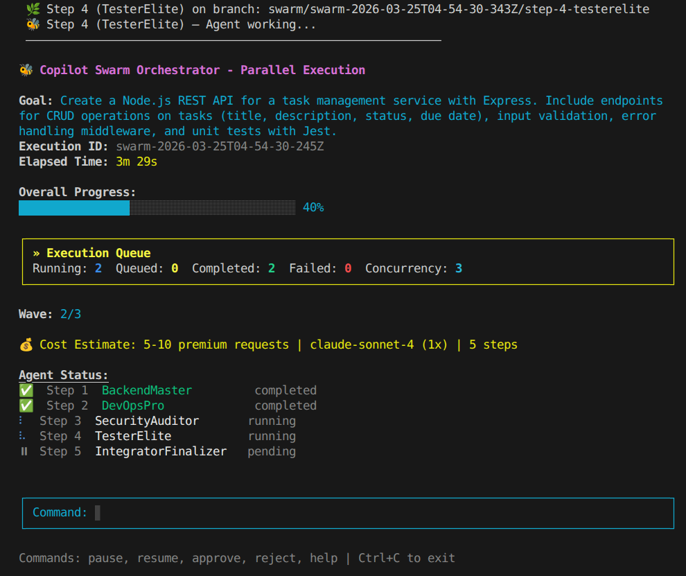

<div align="center">

<br>

<p>
  
  
  
  
  
</p>

# Swarm Orchestrator

**Verification and governance layer for AI coding agents. Parallel execution with evidence-based quality gates, not autonomous code generation.**

_This is not an autonomous system builder. It orchestrates external AI agents (Copilot, Claude Code, Codex) across isolated branches, verifies every step with outcome-based checks (git diff, build, test), and only merges work that proves itself. The value is trust in the output, not speed of generation._

<br>

[](LICENSE)
&nbsp;&nbsp;
[](https://github.com/moonrunnerkc/swarm-orchestrator/actions/workflows/ci.yml)
&nbsp;&nbsp;

&nbsp;&nbsp;

&nbsp;&nbsp;


<br>

[Quick Start](#quick-start) · [What Is This](#what-is-this) · [Quality Benchmarks](#quality-benchmarks) · [Usage](#usage) · [GitHub Action](#github-action) · [Recipes](#recipes) · [Architecture](#architecture) · [Contributing](#contributing)

<br>



<br>

</div>

---

<br>

## Quick Start

```bash
# Install globally
npm install -g swarm-orchestrator
# Or clone and build from source
git clone https://github.com/moonrunnerkc/swarm-orchestrator.git
cd swarm-orchestrator
npm install && npm run build && npm link
```

```bash
# Run against your project with any supported agent
swarm bootstrap ./your-repo "Add JWT auth and role-based access control"

# Use Claude Code instead of Copilot
swarm bootstrap ./your-repo "Add JWT auth" --tool claude-code

# Use Codex
swarm bootstrap ./your-repo "Add JWT auth" --tool codex
```

See it work before pointing it at your code:

```bash
swarm demo demo-fast    # two parallel agents, ~1 min
```

Requires Node.js 20+, Git, and at least one supported agent CLI installed.

| Agent | Install | Auth |
|-------|---------|------|
| GitHub Copilot CLI | `npm install -g @github/copilot` | Launch `copilot` and run `/login` (requires Node.js 22+) |
| Claude Code | `npm install -g @anthropic-ai/claude-code` | `ANTHROPIC_API_KEY` |
| Codex | `npm install -g @openai/codex` | `OPENAI_API_KEY` |

<br>

---

<br>

## What Is This

AI coding agents produce code fast. The problem is knowing whether that code actually works before it reaches your codebase. This orchestrator exists to answer that question with evidence, not assumptions.

Every agent runs on its own isolated git branch. Every claim an agent makes is cross-referenced against its Copilot session transcript for concrete evidence: commit SHAs, test output, build results, file changes. Steps that can't prove their work don't merge. Steps that fail get classified, repaired with targeted strategies, and re-verified. After merge, eight automated quality gates check the generated code for scaffold leftovers, duplicate blocks, hardcoded config, README claim accuracy, test isolation, test coverage, accessibility, and runtime correctness. Nothing reaches main without passing through both the verification engine and the quality gate pipeline.

The orchestrator wraps `copilot -p` (or `/fleet` for native parallel subagent dispatch) as an independent subprocess per step. It runs outside of Copilot's own execution model. You define a goal, it builds a dependency graph, launches steps as dependencies resolve, and manages the full lifecycle: branch creation, agent execution, transcript capture, evidence verification, failure repair, governance review, cost tracking, and merge. The entire execution produces an auditable trail of transcripts, verification reports, and cost attribution that you can inspect after every run.

Before execution begins, the cost estimator predicts premium request consumption based on the plan, model multipliers, and historical failure rates from the knowledge base. You can preview the estimate, set a hard budget, or run without limits.

Started as a submission for the GitHub Copilot CLI Challenge in early 2026 and has grown into a verification, cost governance, and quality gate system for Copilot CLI runs.

<br>

## Features

- **Evidence-based verification** parsing Copilot `/share` transcripts for commit SHAs, test output, build markers, and file changes. No unverified code merges.
- **Quality gates** checking for scaffold leftovers, duplicate code, hardcoded config, README claim drift, test isolation, test coverage, accessibility, and runtime correctness
- **Failure-classified repair** categorizing failures (build, test, missing-artifact, dependency, timeout) and applying targeted fix strategies, up to 3 retries with accumulating context
- **Governance mode** with a Critic agent that scores steps on weighted axes (build, test, lint, commit, claim) and auto-pauses on flags for human approval
- **Strict isolation** forcing per-task branching with cross-wave context restricted to transcript-verified entries only
- **Human-in-the-loop steering** with pause, resume, approve, reject commands and a conflict approval queue
- **Pre-execution cost estimation** predicting premium request consumption per step, factoring in model multipliers (1x for claude-sonnet-4/gpt-4o, 5x for o4-mini, 20x for o3), retry probability from historical failure rates, and overage cost at $0.04 per request over allowance
- **Per-step cost attribution** recording estimated vs actual premium requests, retry counts, prompt tokens, and fleet mode per step, saved to `cost-attribution.json` alongside metrics
- **Greedy as-soon-as-ready scheduling** launching steps the moment their dependencies are satisfied (not when an entire wave finishes), with event-driven dependency resolution, adaptive concurrency, and octopus merge for multi-branch completion
- **Fleet wrapper mode** (`--wrap-fleet`) prefixing step prompts with `/fleet` for Copilot CLI's native parallel subagent dispatch, with version detection and automatic fallback
- **Multi-repo orchestration** with per-repo wave loops, cross-repo verification, and grouped merge
- **Eight agent profiles** (six executing, one repair, one PM) with YAML-defined scope, boundaries, done-definitions, and refusal rules; custom agents supported
- **Persistent sessions** with resume from last completed step, full audit trail, and Markdown report generation
- **Lean mode (Delta Context Engine)** scanning the knowledge base pre-wave for similar past tasks and appending reference blocks to prompts
- **Plan caching and replay** reusing stored plans above 0.85 similarity, or replaying prior verified transcripts for identical steps
- **Deployment rollback** with tag-deploy-verify-rollback cycle and HTTP health checks
- **Knowledge base** capturing execution patterns and cost history across runs for confidence-scored future planning and cost calibration
- **Web dashboard** (single HTML page, dark theme, no build step) with real-time auto-refresh, step badges, wave health, learned patterns, and cost attribution panel with sortable per-step breakdown

<br>

---

<br>

## Quality Benchmarks

The orchestrator's prompt injection and quality gates front-load requirements that developers normally discover through iterative reprompting.

Seven head-to-head comparisons across three agent CLIs, three frontend projects, three backend APIs, and one CLI tool. Full attribute tables, gap analysis, and reprompt projections in [docs/benchmarks.md](docs/benchmarks.md).

| # | Agent | Project Type | Criteria | Agent Score | Orchestrator Score |
|---|-------|-------------|----------|:-----------:|:------------------:|
| 1 | Copilot CLI | Frontend (Markdown Notes) | 30 | 3 | 30 |
| 2 | Claude Code | Frontend (Tic-Tac-Toe) | 24 | 5 | 23 |
| 3 | Codex | Frontend (Calculator) | 34 | 6 | 32 |
| 4 | Claude Code | Backend (REST API) | 36 | 12 | 34 |
| 5 | Copilot CLI | Backend (REST API) | 44 | 13 | 41 |
| 6 | Codex | Backend (REST API) | 48 | 14 | 46 |
| 7 | Claude Code | CLI Tool (Logwatch) | 50 | 30 | 35 |

**Disclosure:** These benchmarks were conducted by the project author, not an independent evaluator. The scoring rubric rewards the same dimensions the orchestrator's quality gates enforce (security, test coverage, production readiness, documentation). Standalone agents are penalized for omitting requirements that were never in the goal prompt. This measures system-level output completeness, not raw model coding ability. See [docs/benchmarks.md](docs/benchmarks.md) for the full assessment with evidence and methodology notes.

**One empirical validation:** The Benchmark 5 gap (Copilot CLI, REST API) was tested with real iterative prompting. Predicted: 13-15 follow-up prompts to reach parity. Actual: 14. See [docs/orchestrator-copilot-benchmarks.md](docs/orchestrator-copilot-benchmarks.md) Part 4.

The orchestrator consistently wins on security hardening (headers, body limits, ID validation), test depth (dedicated unit suites per module, not just integration), configuration externalization (env vars with validation), and production scaffolding (Docker, CI scripts, README, coverage reporting). Standalone agents consistently miss these categories regardless of which CLI is used.

Benchmark 7 (Claude Code CLI tool) was the narrowest gap overall: Claude Code scored 30/50 with an async tailer, log rotation handling, word-boundary level detection, and 5 end-to-end CLI tests. The orchestrator won 35/50, primarily on module structure, project scaffolding, and unit test depth, but Claude Code's core implementation was more production-resilient. This is the only benchmark where the standalone agent produced arguably stronger systems-level engineering than the orchestrator's output.

<br>

---

<br>

## Usage

### Working With Your Codebase

The primary workflow is pointing the orchestrator at an existing repo. `bootstrap` analyzes the codebase (languages, dependencies, build scripts, tech debt), generates a dependency-aware plan scoped to what's already there, and executes it.

```bash
# Analyze a repo and generate a plan
npm start bootstrap ./your-repo "Add comprehensive test coverage"

# Multi-repo orchestration
npm start bootstrap ./frontend ./backend "Add shared auth layer"

# Generate a plan without executing (review first)
npm start plan "Refactor database layer to use Prisma"

# Execute a reviewed plan
npm start swarm plan.json
```

### Single Tasks

For quick, focused work that doesn't need the full orchestration pipeline:

```bash
npm start quick "Fix the race condition in src/worker.ts"
```

### Commands

| Command | Description |
|---------|-------------|
| `npm start bootstrap ./repo "goal"` | Analyze repo(s) and generate a plan |
| `npm start run --goal "goal"` | Generate plan and execute in one step |
| `npm start plan "goal"` | Generate an execution plan from a goal |
| `npm start swarm plan.json` | Execute a plan with parallel agents |
| `npm start quick "task"` | Single-agent quick task |
| `npm start gates [path]` | Run quality gates on a project |
| `npm start use <recipe>` | Run a built-in recipe against current project |
| `npm start recipes` | List available recipes |
| `npm start recipe-info <name>` | Show recipe details and parameters |
| `npm start report <run-dir>` | Generate structured run report from artifacts |
| `npm start audit <session-id>` | Generate Markdown audit report |
| `npm start metrics <session-id>` | Show metrics summary (supports `--json`) |
| `npm start dashboard [port]` | Start the web dashboard (default: 3002) |
| `npm start templates` | List available plan templates |
| `npm start status <id>` | Check execution status |
| `npm start agents` | List configured agent profiles |
| `npm start demo <name>` | Run a demo scenario |


### Key Flags

| Flag | Effect |
|------|--------|
| `--pm` | Enable PM Agent plan review before execution |
| `--model <name>` | Override the Copilot model |
| `--governance` | Enable advisory Critic review wave with scoring and auto-pause |
| `--strict-isolation` | Force per-task branching; restrict context to transcript evidence |
| `--lean` | Enable Delta Context Engine (KB-backed prompt references) |
| `--resume <session-id>` | Resume a previously paused or failed session |
| `--skip-verify` | Skip transcript verification (not recommended) |
| `--no-quality-gates` | Disable quality gate checks |
| `--confirm-deploy` | Enable deployment steps with tag/health-check/rollback (opt-in) |
| `--plan-cache` | Skip planning when a cached plan template matches (>85% similarity) |
| `--replay` | Reuse prior verified transcript for identical steps |
| `--mcp` | Enable MCP integration |
| `--quality-gates-config <path>` | Custom quality gates config file |
| `--cost-estimate-only` | Print pre-execution cost estimate and exit without running |
| `--max-premium-requests <n>` | Abort if estimated premium requests exceed budget |
| `--wrap-fleet` | Prefix step prompts with `/fleet` for native parallel subagent dispatch |
| `--tool <name>` | Agent backend: `copilot` (default), `claude-code`, `codex`, `claude-code-teams` |
| `--param key=value` | Set recipe parameters (with `use` command) |
| `--team-size <n>` | Max concurrent teammates per wave with `claude-code-teams` (1-5) |
| `--owasp-report` | Generate OWASP ASI compliance report after verification |
| `--sarif <path>` | Write quality gate results as SARIF 2.1.0 JSON (use `-` for stdout) |
| `--yes` / `-y` | Skip interactive confirmation prompts |
| `--pr auto\|review` | PR behavior after execution |

<br>

### Examples

```bash
npm start swarm plan.json --governance --lean --strict-isolation --pm
```

Run with Claude Code and OWASP compliance report:

```bash
npm start swarm plan.json --tool claude-code --governance --owasp-report
```

Run quality gates and produce SARIF for GitHub code scanning:

```bash
swarm gates ./your-repo --sarif results.sarif
swarm gates ./your-repo --sarif -  # write to stdout
swarm gates ./your-repo --sarif results.sarif --quality-gates-config custom.yaml
```

Run a recipe:

```bash
npm start use add-tests --tool codex --param framework=vitest --param coverage-target=90
```

Plan and execute in one step:

```bash
npm start run --goal "Build a REST API with JWT auth" --lean --governance
```

Plan with caching:

```bash
npm start plan "Build a CLI tool" --plan-cache
```

Preview cost before running:

```bash
npm start swarm plan.json --cost-estimate-only
```

Run with /fleet and a budget cap:

```bash
npm start swarm plan.json --wrap-fleet --max-premium-requests 30
```

> **Note:** When using `npm start`, flags pass through automatically. If npm warns about an unknown flag, use the `--` separator: `npm start -- plan "goal" --plan-cache`. Not needed with the global `swarm` command.

<br>

### Cost and Premium Requests

Every agent step consumes its own premium request, multiplied by the model's premium request multiplier (1x for claude-sonnet-4, gpt-4o, claude-opus-4; 5x for o4-mini; 20x for o3). A plan with 6 agents on a 1x model uses a minimum of 6 premium requests. When agents run in parallel within a wave, each one simultaneously consumes a request.

The multiplier comes from up to 3 automatic retries per step (exponential backoff), the Repair Agent spawning up to 3 additional sessions on verification failure, and fallback re-execution if all repair attempts fail. In practice, most steps succeed on the first attempt.

<details>
<summary><strong>Pre-execution cost estimation and budgets</strong></summary>

<br>

Before running a plan, the cost estimator predicts premium request consumption:

```bash
swarm swarm plan.json --cost-estimate-only
```

This prints a breakdown showing per-step estimates, retry buffer based on historical failure rates from the knowledge base, model multiplier, and projected overage cost, then exits without executing.

To set a hard budget that aborts execution if the estimate exceeds it:

```bash
swarm swarm plan.json --max-premium-requests 20
```

After execution, per-step cost attribution (estimated vs actual requests, retry counts, prompt tokens, fleet mode, duration) is saved to `cost-attribution.json` in the run directory and displayed in the web dashboard.

</details>

To minimize usage: use `--cost-estimate-only` to preview costs before committing, review your plan with `--pm` before execution, and start with a single `quick` task to verify your setup.

<br>

### Configuration

Agent behavior is defined in YAML config files under `config/`:

| File | Purpose |
|------|---------|
| `default-agents.yaml` | Six built-in step-executing agents |
| `repair-agent.yaml` | Repair Agent for failed-step retries |
| `pm-agent.yaml` | PM Agent for plan validation |
| `user-agents.yaml` | Your custom agents (template included) |

Each profile specifies purpose, scope, boundaries, done-definitions, output contracts, and refusal rules. Add custom agents by editing `user-agents.yaml`:

```yaml
agents:
  - name: MyAgent
    purpose: "What this agent does"
    scope:
      - "Area of responsibility"
    boundaries:
      - "What it should not touch"
    done_definition:
      - "Completion criteria"
```

Quality gate behavior is configured in `config/quality-gates.yaml`:

```yaml
enabled: true
failOnIssues: true
autoAddRefactorStepOnDuplicateBlocks: true
autoAddReadmeTruthStepOnReadmeClaims: true

gates:
  duplicateBlocks:
    enabled: true
    minLines: 12
    maxOccurrences: 2
```

#### Per-project gate configuration

Place a `.swarm/gates.yaml` file in your repository root to override gate defaults for that project. The schema is identical to `config/quality-gates.yaml`. Only include the fields you want to change; everything else inherits from built-in defaults.

```yaml
# .swarm/gates.yaml
gates:
  duplicateBlocks:
    minLines: 20
    maxOccurrences: 3
  accessibility:
    enabled: false
```

Resolution order: built-in defaults, then `.swarm/gates.yaml`, then `--quality-gates-config <path>`. Each layer deep-merges over the previous one. Unknown gate keys cause an error listing valid names.

#### SARIF output

The `--sarif <path>` flag on the `gates` command writes results as a SARIF 2.1.0 JSON file compatible with GitHub code scanning. Upload it via `github/codeql-action/upload-sarif@v3` for inline PR annotations.

In the GitHub Action, set `sarif: true` to automatically run gates and produce SARIF output:

```yaml
- uses: moonrunnerkc/swarm-orchestrator@swarm-orchestrator
  with:
    goal: "Add unit tests for all untested modules"
    tool: claude-code
    sarif: true
```

<br>

---

<br>

## Recipes

Reusable, parameterized plans for common tasks. Recipes modify existing projects (unlike templates, which create new ones).

```bash
npm start recipes                                        # list all
npm start recipe-info add-tests                          # show details
npm start use add-tests                                  # run with defaults
npm start use add-auth --param strategy=session --tool claude-code
```

| Recipe | Steps | Description | Key Parameters |
|--------|-------|-------------|----------------|
| `add-tests` | 3 | Add unit tests for untested modules | `framework` (jest/vitest/mocha), `coverage-target` |
| `add-auth` | 4 | Add authentication | `strategy` (jwt/session) |
| `add-ci` | 3 | Add GitHub Actions CI pipeline | |
| `migrate-to-ts` | 4 | Migrate JavaScript to TypeScript | `strict` (true/false) |
| `add-api-docs` | 3 | Generate OpenAPI spec and docs | `format` (openapi/markdown) |
| `security-audit` | 3 | Run security audit and fix findings | |
| `refactor-modularize` | 4 | Break monolithic code into modules | |

Create custom recipes by adding JSON files to `templates/recipes/`. See [docs/recipes.md](docs/recipes.md) for the schema and examples.

<br>

---

<br>

## Architecture

```
Goal ──> Plan ──> Waves ──> Branches ──> Agents ──> Verify ──> Repair? ──> Merge
```

1. **Plan generation.** A goal becomes numbered steps, each assigned to a specialized agent with declared dependencies. Plans can be generated interactively, imported from a transcript, loaded from a template, or bootstrapped from repo analysis.
2. **Greedy scheduling.** Steps launch the moment their dependencies are satisfied, not when an entire wave finishes. The context broker emits events on step completion; the scheduler picks up newly-ready steps immediately. Adaptive concurrency adjusts limits based on success rates and rate-limit signals. Completed branches merge in batches via octopus merge when possible (one merge commit instead of N).
3. **Branch isolation.** Each step gets its own git worktree and branch (`swarm/<run-id>/step-N-agent`). With `--strict-isolation`, cross-step context is restricted to transcript-verified entries only.
4. **Copilot execution.** The orchestrator invokes `copilot -p` as a subprocess for each step, injecting the agent prompt plus dependency context from completed steps. Transcripts are captured via `/share` export.
5. **Verification.** The verifier parses each transcript for concrete evidence: commit SHAs, test runner output, build markers, file-change records. Agent claims are cross-referenced against this evidence. Missing required evidence fails the step.
6. **Critic review** (with `--governance`). A Critic wave runs after execution, before merge. The Critic scores each step using weighted deductions (build: -25, test: -20, commit: -10, lint: -5, claim: -5), produces a recommendation (approve/reject/revise), and auto-pauses on any flags for human approval. Scores are advisory; final merge decisions rest with the operator.
7. **Self-repair.** Failed steps are retried up to three times. The Repair Agent classifies each failure (build, test, missing-artifact, dependency, timeout) and applies a targeted strategy. Context accumulates across attempts.
8. **Merge.** Verified branches merge to main in wave order. For multi-repo plans, each repo group is verified independently before cross-repo verification and final merge.

<br>

```
                     ┌─────────────────────┐
                     │     Goal / Plan      │
                     └──────────┬───────────┘
                                │
                     ┌──────────▼───────────┐
                     │   PM Agent Review    │  (optional --pm)
                     └──────────┬───────────┘
                                │
                     ┌──────────▼───────────┐
                     │  Multi-Repo Grouping │  (optional repo field)
                     └──────────┬───────────┘
                                │
                     ┌──────────▼───────────┐
                     │   Wave Scheduler     │  topological sort + lean KB scan
                     └──────────┬───────────┘
                                │
              ┌─────────────────┼─────────────────┐
              │                 │                  │
     ┌────────▼──────┐  ┌──────▼───────┐  ┌──────▼───────┐
     │  Agent on     │  │  Agent on    │  │  Agent on    │
     │  branch step-1│  │  branch step-2│  │  branch step-3│
     └────────┬──────┘  └──────┬───────┘  └──────┬───────┘
              │                 │                  │
     ┌────────▼──────┐  ┌──────▼───────┐  ┌──────▼───────┐
     │   Verifier    │  │   Verifier   │  │   Verifier   │
     └────────┬──────┘  └──────┬───────┘  └──────┬───────┘
              │                 │                  │
              │     ┌───────────▼──────────┐      │
              └────>│   Repair Agent       │<─────┘  (up to 3 retries)
                    └───────────┬──────────┘
                                │
                    ┌───────────▼──────────┐
                    │   Critic Review      │  (optional --governance)
                    └───────────┬──────────┘
                                │
                    ┌───────────▼──────────┐
                    │   Merge to main      │
                    └───────────┬──────────┘
                                │
                     ┌──────────▼───────────┐
                     │   Quality Gates      │  (8 automated checks)
                     └──────────┬───────────┘
                                │
                     ┌──────────▼───────────┐
                     │   Meta Analyzer      │  health + pattern detection
                     └──────────────────────┘
```

<br>

<details>
<summary><strong>Key modules</strong> (84 source files, 23,522 lines of TypeScript)</summary>

<br>

| Module | Lines | Responsibility |
|--------|-------|----------------|
| `swarm-orchestrator.ts` | 2,348 | Greedy scheduler, event-driven dependency resolution, octopus merge, multi-repo grouping, governance, lean mode, replay, cost tracking, merge orchestration |
| `cli-handlers.ts` | 2,119 | Command handlers for all CLI subcommands, flag parsing, report/recipe/OWASP dispatch |
| `cli.ts` | 196 | Command dispatch entry point, routes to cli-handlers |
| `verifier-engine.ts` | 1,106 | Evidence checking against transcripts (accepts pre-parsed index to avoid double parse), verification report generation |
| `plan-generator.ts` | 938 | Plan creation, dependency validation, Copilot-assisted generation, plan-cache short-circuit |
| `share-parser.ts` | 673 | Transcript parsing: files, commands, tests, commits, claims, MCP evidence |
| `demo-mode.ts` | 700 | Six demo scenarios with full agent prompts and expected outputs |
| `session-executor.ts` | 657 | Copilot CLI subprocess management, transcript capture, /fleet prompt wrapping |
| `dashboard.tsx` | 558 | TUI dashboard with real-time progress, repo status, per-axis critic scores, lean savings |
| `repair-agent.ts` | 442 | Self-repair loop with failure classification, targeted strategies, context accumulation |
| `step-runner.ts` | 432 | Single-step execution with branch setup, context injection, cleanup |
| `context-broker.ts` | 404 | Shared state, EventEmitter-based step completion signaling, git locking, dependency context injection, strict isolation filter |
| `config-loader.ts` | 382 | YAML agent profile loading with validation and merge |
| `repo-analyzer.ts` | 354 | Codebase scanning for languages, deps, build scripts, tech debt |
| `knowledge-base.ts` | 338 | Persistent cross-run pattern storage (including cost history), Levenshtein similarity, findSimilarTasks |
| `quick-fix-mode.ts` | 319 | Single-agent quick task runner |
| `copilot-cli-wrapper.ts` | 315 | CLI wrapper with strict isolation guard and degraded fallback |
| `meta-analyzer.ts` | 305 | Wave health scoring, pattern detection, replan decisions |
| `pm-agent.ts` | 303 | Plan validation: cycles, unknown agents, stale metadata |
| `steering-router.ts` | 290 | Human-in-the-loop commands during execution |
| `deployment-manager.ts` | 249 | Preview deployment, tag/health-check/rollback cycle, deployment metadata persistence |
| `cost-estimator.ts` | 247 | Pre-execution cost prediction with model multipliers, retry calibration, knowledge base integration |
| `owasp-mapper.ts` | 206 | Maps verification results to OWASP ASI Top 10 risk assessments |
| `metrics-collector.ts` | 182 | Metrics tracking, session save/load, audit report generation |
| `wave-resizer.ts` | 166 | Adaptive wave splitting, merging, and concurrency adjustment |
| `adapters/claude-code-teams.ts` | 159 | Claude Code Agent Teams adapter with fallback to standard adapter |
| `recipe-loader.ts` | 123 | Recipe loading, parameterization, listing |
| `report-generator.ts` | 183 | Assembles structured run reports from execution artifacts |
| `report-renderer.ts` | 89 | Renders run reports to Markdown, JSON, and single-line TUI summary |
| `fleet-wrapper.ts` | 101 | /fleet prompt prefix, version detection, subagent count heuristic |
| `owasp-report-renderer.ts` | 43 | Renders OWASP compliance reports to Markdown and JSON |

</details>

<details>
<summary><strong>Output artifacts</strong></summary>

<br>

```
runs/<execution-id>/
  session-state.json                    # full execution state (resumable)
  metrics.json                          # timing, commit count, verification stats
  cost-attribution.json                 # per-step estimated vs actual premium requests
  knowledge-base.json                   # patterns learned from this run (including cost history)
  wave-N-analysis.json                  # per-wave health assessment
  report.md                             # structured run report (with swarm report)
  report.json                           # machine-readable run report
  owasp-compliance.md                   # OWASP ASI compliance report (with --owasp-report)
  owasp-compliance.json                 # machine-readable OWASP report
  steps/
    step-N/share.md           # raw agent transcript
  verification/
    step-N-verification.md    # outcome-based pass/fail report
```

</details>

<br>

---

<br>

## Demos

Six built-in scenarios for verifying your setup or seeing the pipeline end-to-end.

> **Cost note:** Demos run real agent sessions against real APIs. Each step consumes at least one premium request (or API call for Claude Code / Codex). Larger demos with expensive models can use significant budget. For example, `saas-mvp` with `o3` (20x multiplier) could consume 160+ premium requests. Use `--cost-estimate-only` to preview costs before committing.

```bash
npm start demo list          # see all scenarios
npm start demo-fast          # quickest: two parallel agents, ~1 min
npm start demo <name>        # run any scenario
```

<details>
<summary><strong>All demo scenarios</strong></summary>

<br>

| Scenario | Agents | Waves | What gets built | Time |
|----------|--------|-------|-----------------|------|
| `demo-fast` | 2 | 1 | Two independent utility modules (parallel proof) | ~1 min |
| `dashboard-showcase` | 4 | 3 | React + Chart.js analytics dashboard, Express API, dark theme, ~27 tests | ~8 min |
| `todo-app` | 4 | 3 | React todo app with Express backend and test suite | ~15 min |
| `api-server` | 6 | 4 | REST API with JWT auth, PostgreSQL/Prisma, Docker, CI/CD | ~25 min |
| `full-stack-app` | 7 | 5 | Full-stack todo with auth, Playwright E2E, Docker, CI/CD | ~30 min |
| `saas-mvp` | 8 | 5 | SaaS MVP with Stripe payments, analytics, security audit, deployment | ~40 min |

</details>

<details>
<summary><strong>Output quality</strong> (dashboard-showcase example)</summary>

<br>

The `dashboard-showcase` demo typically produces 9 source files and 3 test files (React 18, Vite 5, Express 4, Chart.js 4) totaling ~1,300 lines that pass these checks out of the box:

- **Build:** `vite build` completes with zero warnings
- **Tests:** ~27 passing (unit + API integration) using the Node.js built-in test runner
- **Accessibility:** semantic HTML, 20+ ARIA attributes, `:focus-visible` styles, `aria-live` for dynamic content, skip-to-content link
- **Responsive:** three CSS breakpoints (1440px wide layout, 1024px sidebar collapse, 640px single column)
- **Error handling:** React ErrorBoundary, fetch error banner with retry, loading skeletons, abort controller cleanup
- **Documentation:** generated README with install, run, test instructions and architecture overview

</details>

<details>
<summary><strong>Demo cost reference</strong></summary>

<br>

| Scenario | Steps | Min requests (1x model) | Max requests (all retries + repairs) |
|----------|-------|-------------------------|--------------------------------------|
| `demo-fast` | 2 | 2 | ~14 |
| `dashboard-showcase` | 4 | 4 | ~28 |
| `api-server` | 6 | 6 | ~42 |
| `saas-mvp` | 8 | 8 | ~56 |

</details>

<br>

---

<br>

## Status

Actively maintained. 84 source files, 95 test files, 50 tests passing. Development is ongoing with regular updates.

See [Releases](https://github.com/moonrunnerkc/swarm-orchestrator/releases) for version history.

<br>

---

<br>

## Contributing

```bash
npm install && npm run build && npm test
```

Before submitting a PR: run `npm test`, run `swarm gates .`, and keep commits descriptive. TypeScript strict mode, ES2020 target.

<br>

---

<br>

## License

[ISC](LICENSE)

Built by [Bradley R. Kinnard](https://github.com/moonrunnerkc).